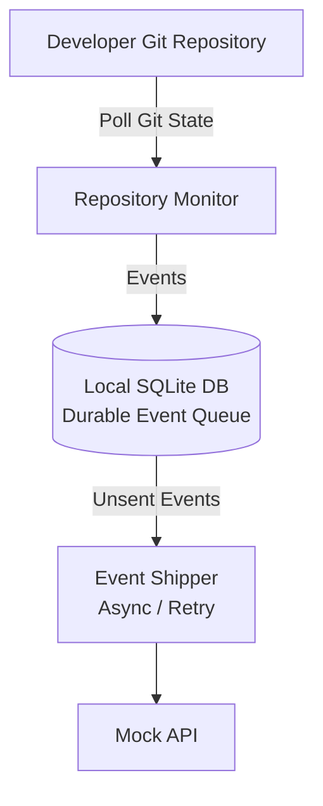

## Architecture

## Initial Project Structure
git-agent/
│
├── agent/
│   ├── __init__.py
│   ├── config.py
│   ├── git_monitor.py
│   ├── storage.py
│   └── main.py
│
├── data/
│
├── requirements.txt
└── README.md